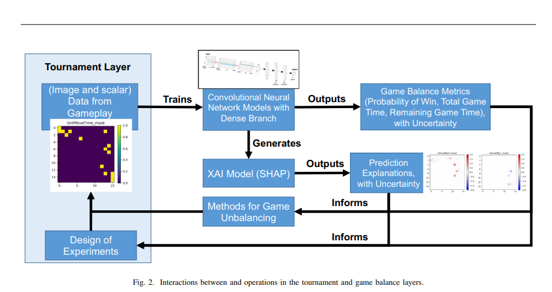

### Delaurentis, Daniel \& Panchal, Jitesh \& Raz, Ali \& Balasubramani, Prajwal \& Maheshwari, Apoorv \& Dachowicz, Adam \& Mall, Kshitij. (2021). Toward Automated Game Balance: A Systematic Engineering Design Approach. 10.1109/CoG52621.2021.9619032.

Research on Automated game balancing on Real-Time Strategy(RTS) games.

Research question: how do they automate game balancing while effectively exploring a large and complex design space?

A tool was developed to automate map evaluation, visualise them on-screen and propose alternative designs in a RTS game.

Monte Carlo Tree searches and Reinforcement Learning methods to evaluate game states.

#### A three layer framework:

##### **Player Layer:**

Bots vary widely in skill level and strategy space, from rule-based to Reinforcement Learning (RL) bots. Player agents are subject to varying set of resources and unit attributes.

##### **Tournament Layer:**

Conducts multiple parallel games between player AI agents. Initial sets of games (tournaments) are conducted in parallel to obtain initial data sets

using experimental design techniques, like Latin Hypercube

sampling. 

The tournament, along with information about the

uncertainty in both model outcomes (supervised learning for

prediction and XAI for post-hoc feature importance analysis),

can then be used to sequentially determine the next set of

tournaments to execute.

This approach helps manage the

extensive design space and generates targeted data sets that

maximize learning of the game balance and identification of

feature sets. 

In addition to generating game data sets for

learning game balance, another primary role of the Tournament

Layer is to validate the game balance predictions derived from

the AI models in the Game Balance Layer and the response

of these models to any perturbations and unforeseen input.  

Note that we only consider games played

between identical bots in this analysis to control for differences

in player skill; we refer to these games as self play games.

##### **Game Balance Layer:** 

This layer provides the overall solution for the balancing

task by collecting, processing, and fusing information to

determine the map between game design features and the probability of win for each player. 
By identifying these feature sets,
the Game-balance Layer can yield the combination of factors
within the input space that will maintain and/or shift the game
balance to one player’s advantage/disadvantage. This learning
of the game balance and identification of significant feature
sets is an iterative process subject to the available game data
provided by the Tournament Layer.
Implemented a neural network model 

#### **Results**
Help a game designer develop a game maximally balance between both players. From the Player Layer, a set of 25,000 example games run by the Tournament Layer with varying game parameters by the game designers's control. Data from sample games is passed to the Game Balance Layer, from which balance estimates(A learning model), can be made from example games.  
##### SHAP: SHAP (SHapley Additive exPlanations) is a game theoretic approach to explain the output of any machine learning model. It connects optimal credit allocation with local explanations using the classic Shapley values from game theory and their related extensions (see papers for details and citations).
Consider SHAP results that relate input spatial and non-spatial features to the prediction that the underdog Player 0 will win. 
Using visualisation of SHAP results, to predict whether a certain attribute positively impacts the chances of a player will win or not.

Perturbations are introduced to bring balance in the game.

